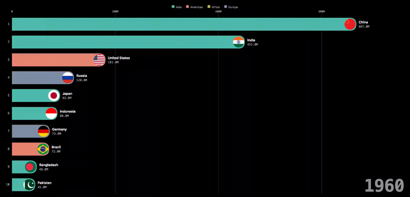

# frontrunner

Bar chart races from a CSV or JSON file. One HTML file, zero runtime dependencies, runs entirely in your browser.

**Live:** https://centered-tangle-v266.here.now/



Drop in a dataset — CSV or a JSON array of records, long or wide format, it figures out which — check the column mapping, and watch the race. Lay it out, theme it, brand it, scrub it, and share the whole thing as a URL: the dataset travels compressed inside the link, no server involved.

## Use it

Open `dist/index.html`. That's the product — it works hosted or straight from `file://`.

- **Input:** drag-drop a `.csv` or a JSON array of objects, paste either as text, or fetch from a URL. Long format (`year,country,population`) and wide format (`country,1960,1970,…`) both work, for both formats. Also opens `.frontrunner.json` project files directly.
- **Auto-detected columns:** time, entity, and value are guessed from the data; optional image, category, and `#rrggbb` color columns are picked up the same way, or set manually. Entities without an explicit color inherit their category's color, or cycle a curated palette — and once entities outnumber the palette, new colors are generated via golden-angle hue rotation rather than repeating.
- **Playback:** play/pause (space), scrub, step with arrow keys, 0.5–4× speed, loop. Time pacing can be equal-per-period or **proportional to real elapsed time** (a 40-year gap animates longer than a 5-year one) for datasets with real, chronological period labels.
- **Storytelling:** timed captions with optional pause-on-event, a follow mode that spotlights one entity (persists in share links), a leader/total sparkline, and a floating median/mean reference bar.
- **Settings** control how much and how fast: top-N (or bottom-N), speed, easing, linear or log value scale, value/period formatting (including day-level dates), axis scale (dynamic or fixed-at-global-max).
- **Layouts** control where things sit: a placeholder grid — assign the title, logo, period clock, running total, source line, category legend, and event caption to any corner (or off), plus the bar-row composition (labels, images inside/overlapping/outside the bar end). Three built-ins including *Broadcast* (centered title, giant bottom-center clock). A soft warning flags accidental anchor collisions without blocking them.
- **Themes** control looks: colors, fonts, bar radius (Square/Soft/Round/Pill), bar thickness, an optional background (subtle glow, dot grid, or a custom image URL) — all CSS custom properties. Save your own layouts and themes to a personal library.
- **Templates** bundle a Layout + Theme + a curated "look and feel" subset of Settings into one click — three built-ins (Classic Race, Broadcast Bold, Minimal Print), or save your own combination.
- **Brand** is what it says: title, subtitle, logo (by URL), source line, and a link that stays clickable in exports.
- **Share:** the project compresses into the URL hash via the browser's native `CompressionStream` — typical datasets are a couple of KB. Big datasets get a friendly warning and a file-export alternative. Whether the original source data travels along is your choice — include all of it, trim to just the columns you're using, or leave it out entirely.
- **Persistence:** every race autosaves to a local library (open / rename / duplicate / delete from the home screen). Export/import `.frontrunner.json` project files, export a **standalone snapshot** — a self-contained `.race.html` that auto-plays anywhere, with an option to embed images as base64 for full offline use — or export a real **WebM video**, landscape or 9:16 portrait, recorded from the actual playback engine so holds and easing come through correctly.
- **Compatibility:** the project format is versioned (currently v4) with an automatic migration chain — old share links and files keep opening.

Nothing you load ever leaves your machine. There is no server.

## Develop

Requires [Bun](https://bun.sh) for the dev server, tests, and build — the app itself has zero runtime dependencies.

```sh
bun run serve       # dev server at http://localhost:3300 (or just open src/index.html)
bun test            # parser, engine, share-codec, validator, and DOM smoke tests
bun run build       # → dist/index.html, one file, zero external requests
bunx playwright test  # real-browser e2e suite (Chromium)
```

### Layout

```
src/
  parse.js      CSV/JSON parser, shape detection, normalization
  engine.js     rank precompute, interpolation, frame state, playback clock (pure, no DOM)
  render.js     SVG painter (node recycling, attribute updates only per frame)
  editors.js    validators for every editable shape (layout, theme, settings, events, branding)
  migrate.js    project-envelope version migrations
  share.js      project envelope, gzip → base64url share-link codec
  store.js      localStorage autosave + personal library
  builtins.js   built-in layouts, themes, templates, sample dataset
  app.js        state machine + wiring
  index.html    shell
  styles.css    UI chrome (chart visuals derive from theme vars)
scripts/
  build.ts      bundles + inlines everything into dist/index.html
  serve.ts      dev server
  deploy.ts     publishes dist/index.html to the live site
test/           unit + DOM smoke tests (bun test)
e2e/            real-browser Chromium tests (Playwright)
```

## Roadmap

- **v1 (complete):** the race — parser, engine, playback, the five-concern editor (Data / Settings / Layout / Theme / Brand), personal libraries, project library, share links, standalone snapshot export, versioned format with migrations
- **v1.5 (complete):** entity images by URL reference
- **v1.6 (complete):** category colors, events & captions, bottom-N/log scale, follow mode, sparkline, ghost reference bar
- **v1.7–v1.8 (complete):** UX review pass, daily/sub-year periods, background patterns, palette-overflow color generation
- **v2 (complete):** JSON dataset input, a user choice over what raw source data travels in exports, image embedding at export, WebM video export (landscape + 9:16 portrait), Templates, proportional time scale

See `PRD.md` for the full spec, concept model, decision log, and incidents log.

MIT
